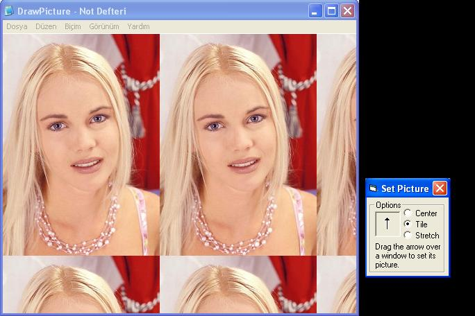



## Set Picture To Any Window

### Description

to teach how to set any window any picutre(any format.)
 
### More Info
 

             |
---                |---
**Submitted On**   |2006-03-03 20:51:16
**By**             |[Basak Karpuz](https://github.com/Planet-Source-Code/PSCIndex/blob/master/ByAuthor/basak-karpuz.md)
**Level**          |Advanced
**User Rating**    |5.0 (15 globes from 3 users)
**Compatibility**  |VB 6\.0
**Category**       |[Windows API Call/ Explanation](https://github.com/Planet-Source-Code/PSCIndex/blob/master/ByCategory/windows-api-call-explanation__1-39.md)
**World**          |[Visual Basic](https://github.com/Planet-Source-Code/PSCIndex/blob/master/ByWorld/visual-basic.md)
**Archive File**   |[Set\_Pictur197824362006\.zip](https://github.com/Planet-Source-Code/basak-karpuz-set-picture-to-any-window__1-64548/archive/master.zip)

